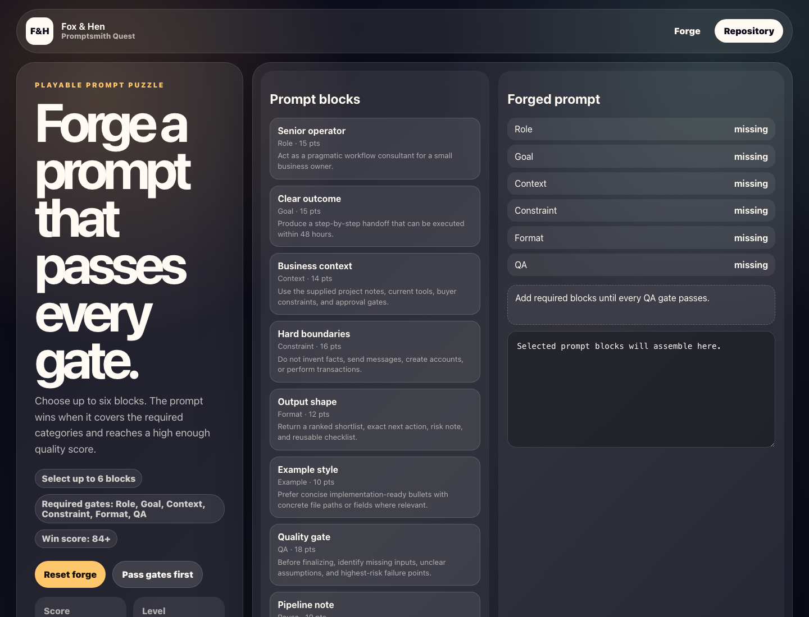

# Promptsmith Quest

A playable prompt-building puzzle with constraints, QA gates, and final prompt scoring.



## Live Demo

- Demo: [https://foxhen-promptsmith-quest.vercel.app](https://foxhen-promptsmith-quest.vercel.app)
- Repository: [https://github.com/foxandhenllc/foxhen-promptsmith-quest](https://github.com/foxandhenllc/foxhen-promptsmith-quest)

## Fully Working Behaviors

- Playable local state with scoring and success/failure conditions.
- Keyboard or click controls documented in the interface.
- Deterministic test hooks exposed as `window.render_game_to_text` and `window.advanceTime`.
- No backend, auth, external service calls, production data, or customer work.

## Local Run

```bash
npm install
npm run dev
npm run build
```
